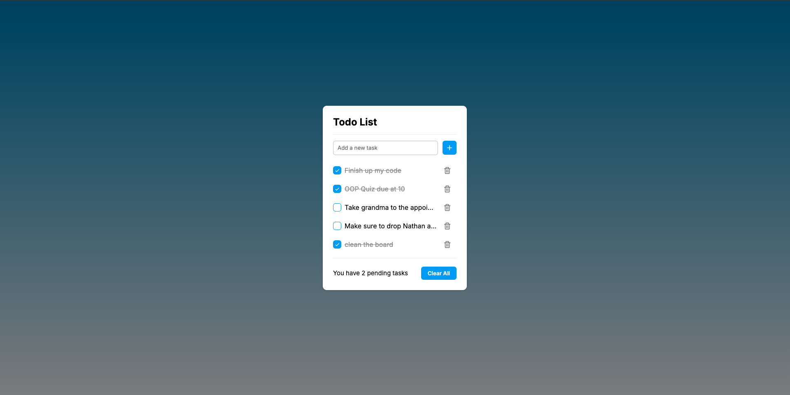

# Todo List Application

A simple Todo List application built with HTML, CSS, and JavaScript. This application helps you manage your tasks effectively by allowing you to add, mark as complete, and delete tasks, while saving them in your browser's local storage.

## Table of Contents

- [Demo](#demo)
- [Features](#features)
- [Technologies Used](#technologies-used)
- [Setting Up](#setting-up)
- [Usage](#usage)
- [Code Structure](#code-structure)

## Demo

Here’s a visual representation of the Todo List application:



## Features

- **Add Tasks:** Easily add new tasks to your list.
- **Complete Tasks:** Mark tasks as completed by clicking on them. Completed tasks will show a checkmark and cross out.
- **Delete Tasks:** Easily Remove tasks from the list by clicking the delete button.
- **Persistent Storage:** Tasks are saved in your browser’s local storage, so you won't lose them after closing the browser.
- **Clear All Tasks:** Removes all tasks at once.
- **Responsive Design:** Optimized the design for both desktop and mobile devices.

## Technologies Used

- **HTML:** Provides the structure for the application.
- **CSS:** Styles the application with a modern and clean design.
- **JavaScript :** Used for the functionality of the app, including managing tasks and local storage handling.
- **Boxicons:** Used for icons within the app.

## Setting Up

To set up the Todo List application locally on your machine, follow these steps:

### Prerequisites

- A modern web browser 

### Steps

1. **Clone the repository:**

   ```bash
   git clone https://github.com/myhavok/todo-list.git

2. **Navigate to the directory:**
- cd todo-list
3. **Open the Application:**
- Open the index.html file in the browser
   ## Usage

### Adding a Task
1. Type your task in the input field.
2. Press the "Enter" key or click the plus button (`+`) to add the task to your list.

### Completing a Task
- Click the check button next to the task to mark it as completed. The task will have a strikethrough and a checkmark will appear.

### Deleting a Task
- Click the trash button next to the task to remove it from the list.

### Clearing All Tasks
- Click the "Clear All" button to remove all tasks at once.

## Code Structure

- **`index.html`:** Contains the HTML structure of the application.
- **`style.css`:** Contains the CSS styles for the application, including the layout, colors, and effects.
- **`script.js`:** Contains the JavaScript code that handles the application's logic, such as adding, deleting, and marking tasks as complete.

## JavaScript Breakdown

- **Selectors:** Used to select and manipulate DOM elements.
- **Event Listeners:** Attached to handle user interactions, such as clicks and key presses.
- **Functions:**
  - `addTodo()`: Adds a new task to the list.
  - `clearAll()`: Clears all tasks from the list.
  - `saveTodo()`: Saves the current state of the task list to local storage.
  - `loadTodo()`: Loads the tasks from local storage on page load.
  - `updateTaskCount()`: Updates the display of the number of pending tasks.
  - `updateTaskEvents()`: Sets up event listeners for the check and delete buttons.
